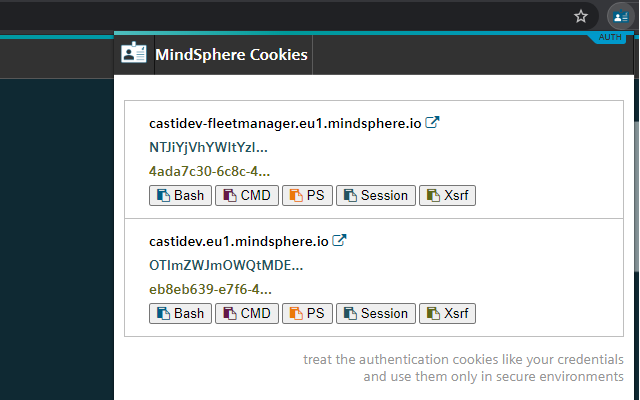
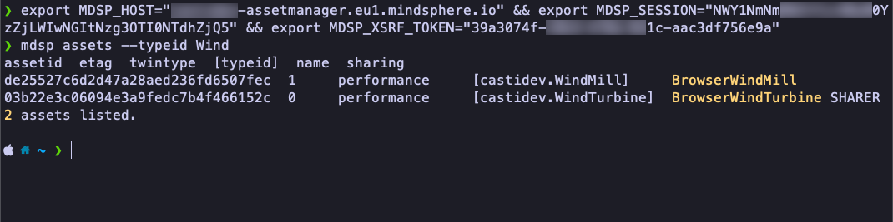

# MindSphere Authorization Helper Chrome Extension

This chrome extension can be used to simplify the development tasks for which you need to use the [SESSION and XSRF-TOKEN](https://developer.mindsphere.io/howto/howto-local-development.html#generate-user-credentials) to access MindSphere APIs. It provides an easy way to copy the MindSphere authentication cookies to the clipboard without having to go to chrome developer tools.

## MindSphere CLI

The extension works also really well with the MindSphere CLI in the [Session Cookie - XSRF-Token Configuration](https://opensource.mindsphere.io/docs/mindconnect-nodejs/cli/setting-up-the-cli.html#tab1anchor3)

Use the extension to copy the cookies to the clipboard, paste them to the command line (there is bash, Windows CMD and Windows Powershell support) and start using the [MindSphere CLI](https://opensource.mindsphere.io/docs/mindconnect-nodejs/cli/index.html) right away.

## MindSphere Development Proxy

You can also use the extension to simplify the start of [MindSphere Development Proxy](https://opensource.mindsphere.io/docs/mindconnect-nodejs/cli/development-proxy.html) in a similar fashion. Just copy/paste the cookies to the command line and [start the development proxy](https://opensource.mindsphere.io/docs/mindconnect-nodejs/cli/development-proxy.html#tab1anchor1).

**Important: Treat the authentication cookies like your credentials and use them only in secure environments.**
