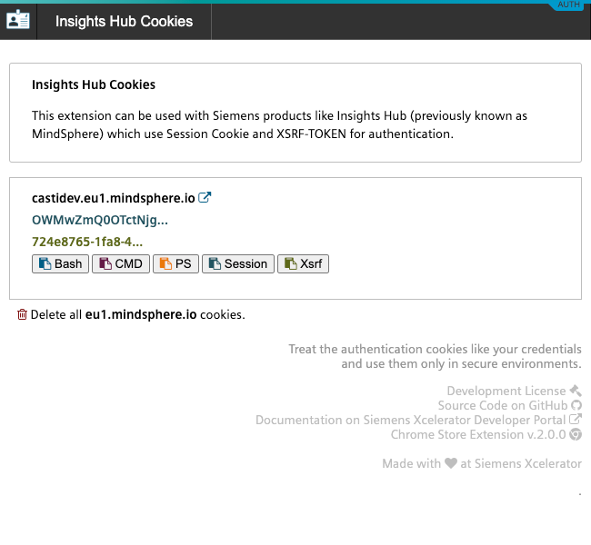
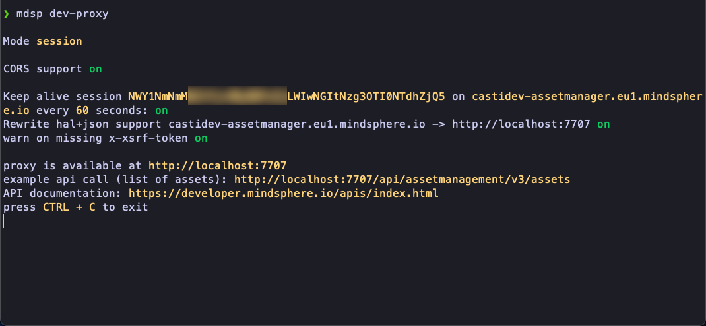

# Insights Hub and Industrial IoT Authorization Helper Chrome Extension

MindSphere has evolved into [Insights Hub](https://plm.sw.siemens.com/en-US/insights-hub/).


This chrome extension can be used to simplify the development tasks for which you need to use the [SESSION and XSRF-TOKEN](https://developer.mindsphere.io/howto/howto-local-development.html#generate-user-credentials) to access Insights Hub and Indutrial IoT APIs. It provides an easy way to copy the Insights Hub and Indutrial IoT authentication cookies to the clipboard without having to go to chrome developer tools.

## Installation

Go to <a href="https://chrome.google.com/webstore/detail/mindsphere-authentication/licndiiilobojikmhmmcgdbpmnmdeoee"><i class="fab fa-chrome"></i> chrome web store</a> and click on **add to chrome**.

Once the extension is installed: log in to your Insights Hub and Indutrial IoT tenant, navigate to your application and click on the extension icon to display the available application cookies. You can now click e.g. on **session** or **Xsrf** button which will copy the corresponding cookie to your clipboard.



The cookies can be used with the tools like [curl](https://developer.mindsphere.io/howto/howto-local-development.html#curl-example), [postman](https://developer.mindsphere.io/howto/howto-local-development.html#postman-example_1) etc. (Click on the links for more examples)

```bash
#!/bin/bash

curl -vv \
  -G \
  --cookie "SESSION=<session-copied-from=browser>;XSRF-TOKEN=<xsrf-copied-from-browser>" \
  -X GET \
  https://<tenantId>-<appId>-<tenantId>.<regionId>.mindsphere.io/api/assetmanagement/v3/assets
```

## Using the cookies with Insights Hub and Indutrial IoT CLI

The extension works really well with the Insights Hub and Indutrial IoT CLI in the [Session Cookie - XSRF-Token Configuration](https://opensource.mindsphere.io/docs/mindconnect-nodejs/cli/setting-up-the-cli.html#tab1anchor3) because the **Bash**, **PS**, and **CMD** buttons already copy the cookies in the required format for Insights Hub and Indutrial IoT CLI.

Use the extension to copy the cookies to the clipboard, paste them to the command line and start using the [Insights Hub and Indutrial IoT CLI](https://opensource.mindsphere.io/docs/mindconnect-nodejs/cli/index.html) right away.


## Using the cookies with Insights Hub and Indutrial IoT Development Proxy

You can also use the extension to simplify the start of [Insights Hub and Indutrial IoT Development Proxy](https://opensource.mindsphere.io/docs/mindconnect-nodejs/cli/development-proxy.html) in a similar fashion. Just copy/paste the cookies to the command line and [start the development proxy](https://opensource.mindsphere.io/docs/mindconnect-nodejs/cli/development-proxy.html#tab1anchor1).



This will start the development proxy with the credentials of the logged in users so that you can test the Insights Hub and Indutrial IoT authentication and authorization also in the local environment.

**Important: Treat the authentication cookies like your credentials and use them only in secure environments.**
